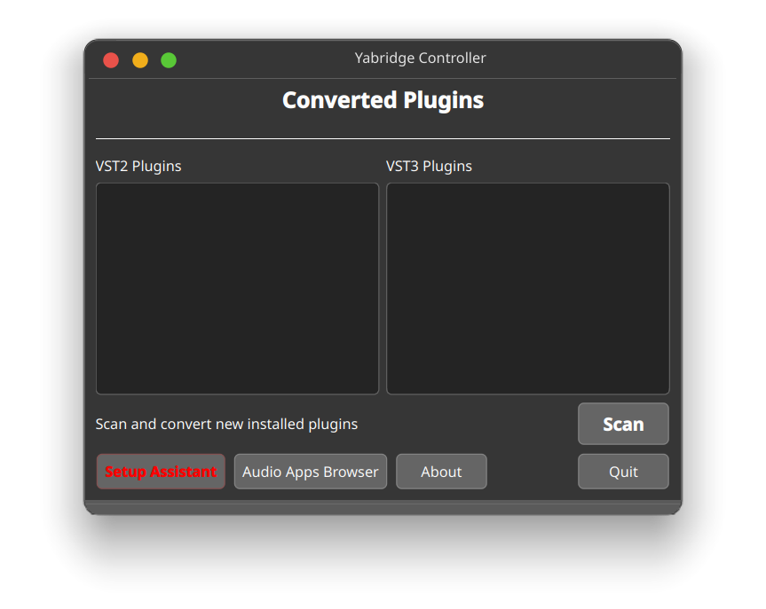
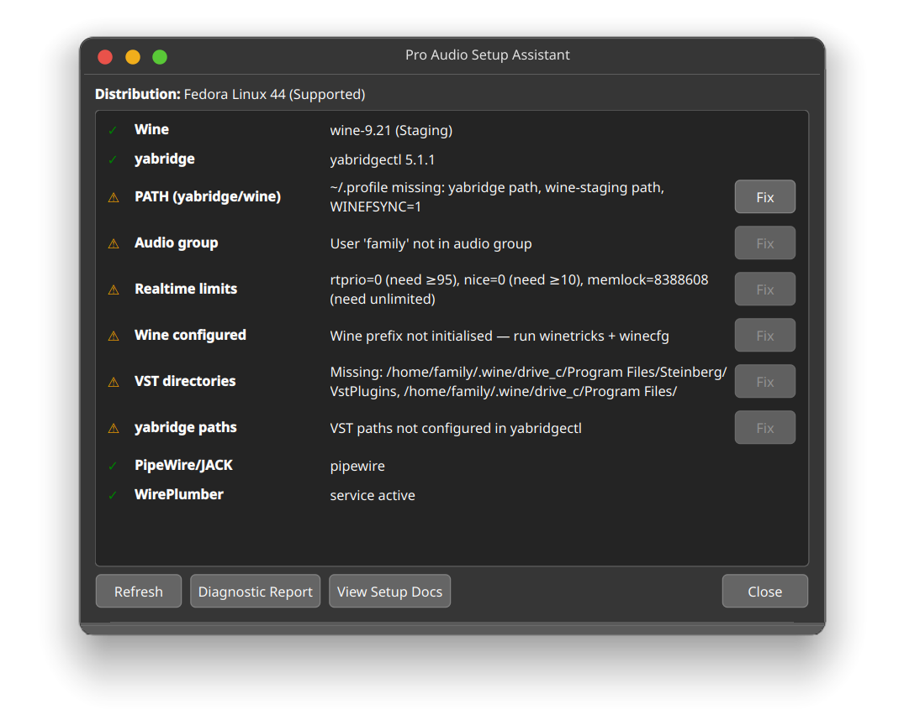
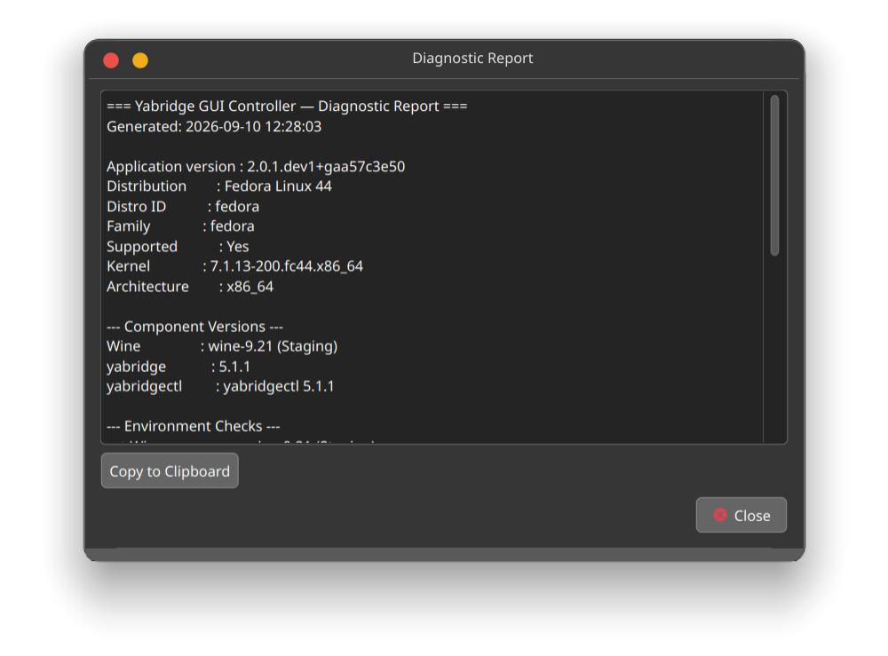
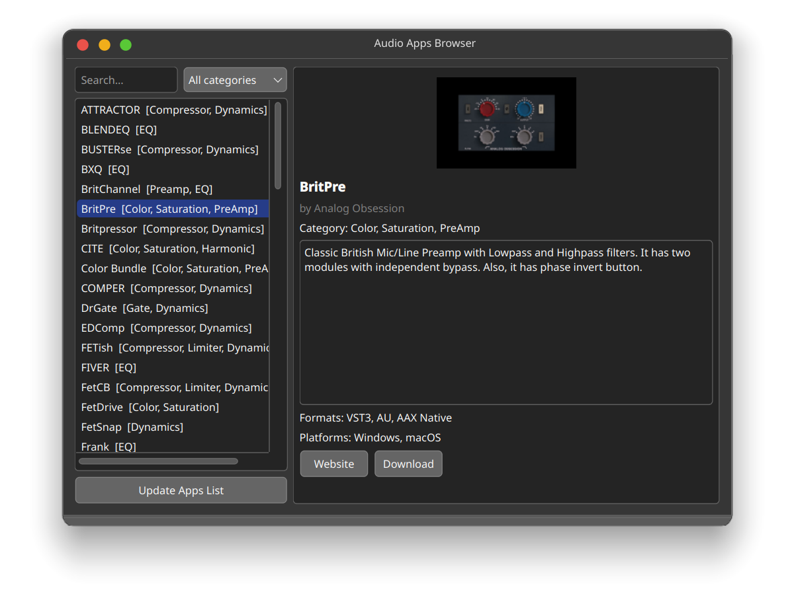

# Yabridge GUI Controller

A Linux desktop application for managing Windows VST/VST3 plugins via [yabridge](https://github.com/robbert-vdh/yabridge) and Wine.

| Main Window | Setup Guide |
| --- | --- |
|  |  |
|  |  |

## Features

- **Plugin browser** — lists all converted VST2 and VST3 plugins
- **One-click sync** — runs `yabridgectl sync` with a progress dialog
- **Pro Audio Setup Assistant** — detects your environment and guides you through setup
- **Guided remediation** — shows what is missing and offers safe automatic fixes
- **Free Plugin Browser** — browse a curated database of free Windows VST plugins
- **Diagnostic report** — generate a system report for troubleshooting

---

## Supported Distributions

| Distribution | Version | Status |
| --- | --- | --- |
| Ubuntu | 26.04 | ✓ Supported |
| Debian | 13 | ✓ Supported |
| Fedora | 44 | ✓ Supported |
| Arch Linux | rolling | ✓ Supported |
| Other | — | Manual instructions |

---

## Installation

### Dependencies

- Python 3.10+
- PyQt6
- PyYAML

#### Debian / Ubuntu

```bash
sudo apt install python3-pyqt6 python3-yaml
```

#### Fedora

```bash
sudo dnf install python3-PyQt6 python3-pyyaml
```

#### openSUSE

```bash
sudo zypper install python3-qt6 python3-yaml
```

#### Arch

```bash
sudo pacman -S python-pyqt6 python-yaml
```

### Install from source

```bash
git clone https://github.com/apapamarkou/yabridge-gui-controller.git
cd yabridge-gui-controller
make install
```

### Package formats

Download from the [Releases](https://github.com/apapamarkou/yabridge-gui-controller/releases) page:

| Format | Command |
| --- | --- |
| `.deb` | `sudo dpkg -i yabridge-gui-controller_*.deb` |
| `.rpm` | `sudo rpm -i yabridge-gui-controller-*.rpm` |
| `.AppImage` | `chmod +x *.AppImage && ./*.AppImage` |
| `.tar.gz` | `tar -xzf *.tar.gz && cd yabridge-gui-controller-* && ./install` |

---

## Pro-Audio Setup

If you need to set up Wine and yabridge from scratch, use the **Setup Assistant** inside the application, or follow the manual instructions for your distribution:

- [Ubuntu 26.04](docs/distros/Ubuntu26.04.md)
- [Debian 13](docs/distros/Debian13.md)
- [Fedora 44](docs/distros/Fedora44.md)
- [Arch Linux](docs/distros/Arch.md)
- [Other distributions](docs/LinuxProAudioSetup.md)

---

## Usage

```bash
# Run from source
make run

# Or after installation
yabridge-gui-controller
```

- **Scan** — sync plugins with `yabridgectl sync` and refresh the plugin lists
- **Setup Assistant** — check your pro-audio environment and fix issues
- **Free Plugins** — browse free Windows VST plugins
- **About** — application information

---

## Free Plugin Browser

The application includes a curated database of free Windows VST plugins. Each entry includes name, developer, category, description, formats, and links to the website and download page.

To add a plugin to the database:

```bash
mkdir database/plugins/my-plugin
# create database/plugins/my-plugin/plugin.yaml
# optionally add database/plugins/my-plugin/image.png
```

See existing entries in `database/plugins/` for the YAML format.

---

## Troubleshooting

Use **Setup Assistant → Diagnostic Report** to generate a system report. Copy it when creating a GitHub issue.

Common issues:

- **Wine not found** — ensure `~/.local/share/wine-staging-9.21/bin` is in your `PATH` (see `~/.profile`)
- **yabridgectl not found** — ensure `~/.local/share/yabridge` is in your `PATH`
- **Scan button disabled** — Wine or yabridgectl is not detected; open Setup Assistant

---

## Development

```bash
git clone https://github.com/apapamarkou/yabridge-gui-controller.git
cd yabridge-gui-controller
make venv
source .venv/bin/activate

make run      # run from source
make test     # run tests
make lint     # lint check
make lint-fix # auto-fix lint
```

---

## Testing

```bash
make test
```

Tests are in `tests/unit/` and `tests/integration/`. GUI tests are minimal and focused on logic.

---

## Packaging

```bash
make package       # interactive — select format and distro version
make packages      # build all formats non-interactively
make test-package  # interactive — test a package format
make test-packages # test all formats (requires Docker)
```

Built packages appear in `packaging/output/`.

Package formats: `.deb` (Debian/Ubuntu), `.rpm` (Fedora/openSUSE), `.pkg.tar.zst` (Arch), `.AppImage`, `.tar.gz` binary tarball, source tarball.

**Note:** Package tests use Docker containers for installation validation only. Real-world release validation is performed manually in VMs before any release is published.

---

## Contributing

See [CONTRIBUTING.md](CONTRIBUTING.md).

---

## License

GNU General Public License v3. See [LICENSE](LICENSE).

---

## Acknowledgements

- [yabridge](https://github.com/robbert-vdh/yabridge) by Robbert van der Helm
- [Wine](https://www.winehq.org/)
- [PyQt6](https://www.riverbankcomputing.com/software/pyqt/)
